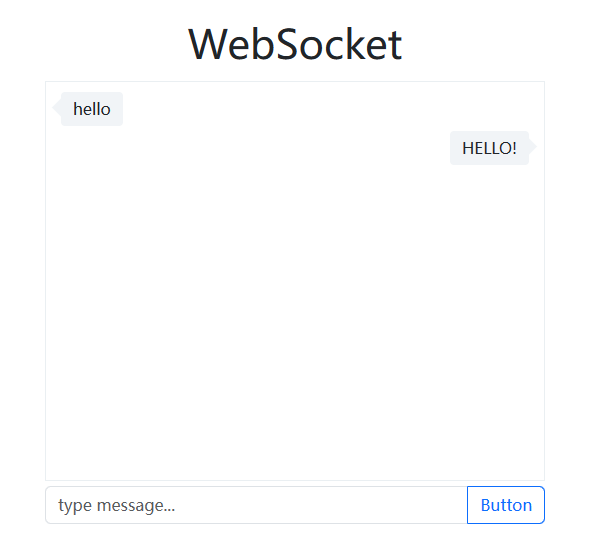

## websocket-chat
> a simple chat app created by websocket.

### run it
1. `yarn install`
2. Run the server side: `node server/app.js`
3. Run the client side: open `index.html`

You can change `server/app.js` and `index.js` for coding!
